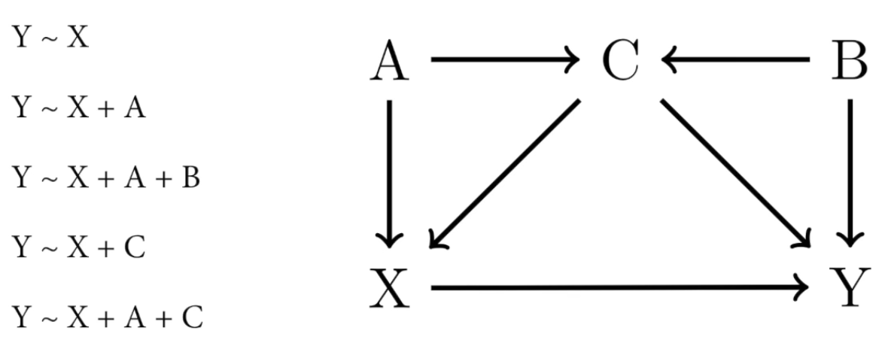
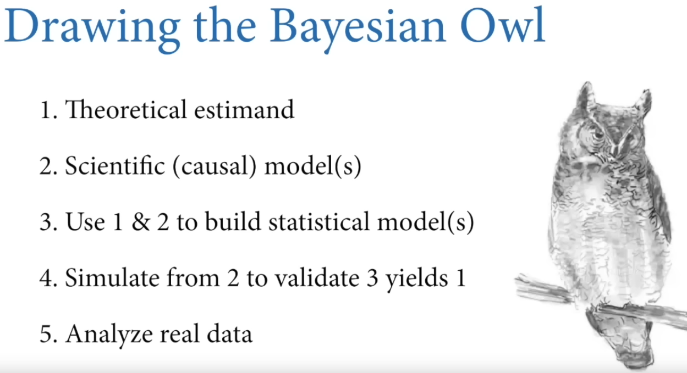

```{r setup, include=FALSE}
knitr::opts_chunk$set(echo = TRUE, warning=FALSE,message = FALSE)
```

___

**Lesson slides and videos at:** [https://github.com/rmcelreath/stat_rethinking_2023](https://github.com/rmcelreath/stat_rethinking_2023){target="_blank"}

  - Science before statistics: 
    + [Video](https://www.youtube.com/watch?v=FdnMWdICdRs&list=PLDcUM9US4XdPz-KxHM4XHt7uUVGWWVSus&index=1){target="_blank"}
    + [Slides](https://speakerdeck.com/rmcelreath/statistical-rethinking-2023-lecture-01){target="_blank"}
  - Garden of forking data:
    + [Video](https://www.youtube.com/watch?v=R1vcdhPBlXA&list=PLDcUM9US4XdPz-KxHM4XHt7uUVGWWVSus&index=2){target="_blank"}
    + [Slides](https://speakerdeck.com/rmcelreath/statistical-rethinking-2023-lecture-02){target="_blank"}
    
___

# Chapter 01: THE GOLEM OF PRAGUE

### Statistical tests are *golems*

*Traditional* statistical tests are powerful little machines that carry out thoughtless tasks. They are designed for very specific conditions, and can't think on their own. They can be applied to incorrect conditions and will still perform their specific tasks without raising any concern.

Provided your experimental designs / hypotheses follow a very well-tested pattern exactly, these *golems* can get the job done. But they are fragile and inflexible if you stray outside of the lines.

What we really need is to know how to build new *golems* for specific circumstances unique to the questions we are trying to answer and the systems we are working in.

## Statistical rethinking

We need to not only understand how to build a *statitical golem* but also how to interpret how their outputs relate to hypotheses and the natural mechanisms of interest.

It is usually impossible to falsify a hypothesis because:

  - **Hypotheses are not models.** Many models can correspond to the same hypothesis, and many hypotheses can correspond to the same model. Many processes produce similar distributions. Null models are rarely unique... In other words, there are always competing explanations for an observation and thus rejecting a single *null* hypothesis doens't mean you found the right explanation!
  - **Measurement matters.** Even when we think we've falsified a hypothesis, another observer might debate our methods or not trust the data. And they may be correct.
  
Research requires more than *null* robots. It also requires **generative causal models**, **statistical models justified by generative models** (can simulate data from them) **& questions (estimands)**, and an **effective way to produce estimates.**

## DAGs

"Directional Acyclic Graphs" that help us intuit the structure of how variables are related. These aren't detailed enough to be considered "generative," that is, they can't be used to simulate data. But they are useful to help us build a model, select good justified controls, *etc.* (finding adjustment set).


A DAG isn't enough by iself. We need to build a generative model, have a strategy for dealing with finite data, determining uncertainty as well.

## Bayesian tools

These are practical for accomplishing the previous goals. Can be overkill in many situations. But in many realistic situations (*measurement error, missing data, latent variables, regluarization*) Bayesian tools make a huge difference.

**Bayesian analysis takes a question in the form of a model and uses logic to produce an answer in the form of probability distributions.** Another way to look at it is "counting the number of ways the data could happen, according to our assumptions."


___

Bayesian models are *generative.*

Doing a Bayesian analysis the "long way" involves:



  1. "What are we even trying to do in this study? What are we measuring?"
  2. Build a DAG and turn it into a generative model.
  3. Build a statistical model that addresses the estimand and can be justified in light of the DAG/causal model.
  4. Testing: simulate from the generative model to validate that the estimator works.
  5. If model is validated, use it on the real data.


